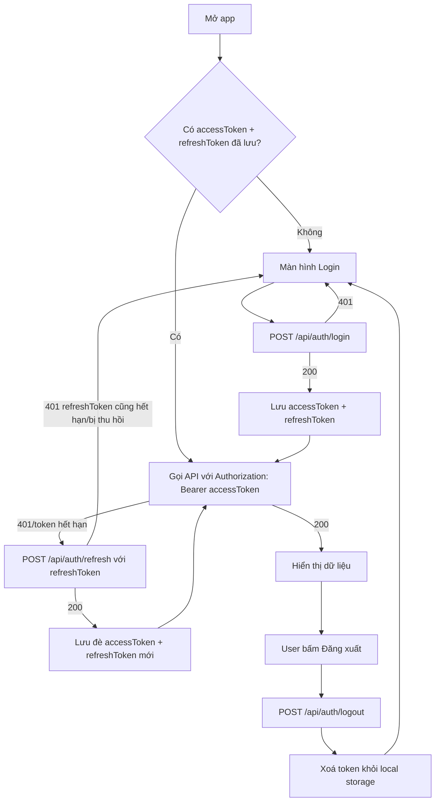
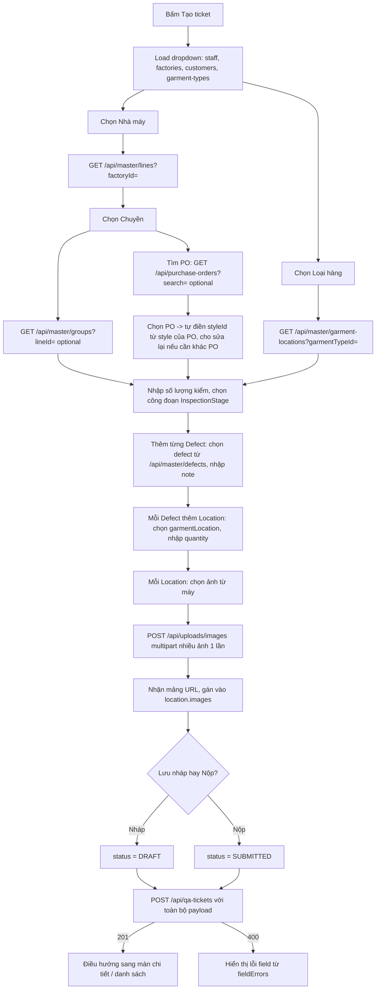
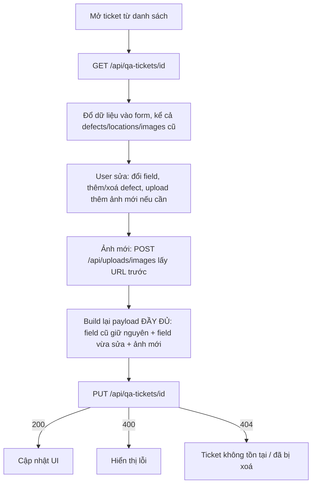
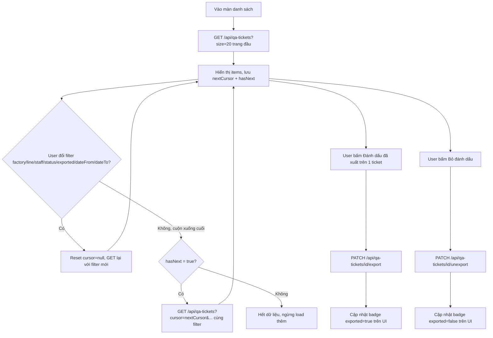

# QMS Backend — API Reference cho Frontend

Base URL: `http://localhost:8080` (local) hoặc URL Render sau khi deploy.
Toàn bộ response là JSON. Toàn bộ `POST/PUT/DELETE/GET` dưới `/api/**` (trừ `/api/auth/login`,
`/api/auth/refresh`, `/api/auth/logout`, và Swagger) **bắt buộc** header:

```
Authorization: Bearer <accessToken>
```

## Định dạng lỗi chung

Mọi lỗi (400/401/403/404/409/500...) đều trả về JSON dạng:

```json
{
  "timestamp": "2026-07-24T10:00:00",
  "status": 400,
  "error": "Bad Request",
  "message": "Validation failed",
  "fieldErrors": { "inspectedQty": "must be greater than 0" }
}
```

`fieldErrors` chỉ có khi lỗi validate field, các lỗi khác thì `fieldErrors: null`.

## Enum dùng chung

- `TicketStatus`: `DRAFT` | `SUBMITTED`
- `InspectionStage`: `INLINE` | `ENDLINE` | `FINAL` | `INPUT`
- `StaffRole`: `QA_INSPECTOR` | `QA_LEAD` | `ADMIN`
- `SpecImageType` (loại ảnh trong `specImages` của ticket):
  - `APPROVED_SAMPLE` — Mẫu duyệt
  - `SIZE_SPEC` — Bảng thông số kích thước
  - `PACKING` — Quy cách đóng thùng/bao bì
  - `HANGTAG_LABEL` — Thẻ treo & nhãn hiệu

---

## 1. Auth

### POST `/api/auth/login`
Không cần token. Body:
```json
{ "username": "QA001", "password": "123456" }
```
Response `200`:
```json
{
  "accessToken": "eyJhbGciOi...",
  "refreshToken": "jS4S8Dhuk1D5...",
  "tokenType": "Bearer",
  "expiresInMs": 3600000,
  "staffId": 1,
  "code": "QA001",
  "fullName": "Nguyễn Văn A",
  "role": "QA_INSPECTOR"
}
```
Sai username/password → `401`.

`accessToken` hết hạn sau **1 giờ** (`expiresInMs`). `refreshToken` hết hạn sau **30 ngày**.

### POST `/api/auth/refresh`
Không cần `Authorization` header, dùng refresh token trong body. Body:
```json
{ "refreshToken": "jS4S8Dhuk1D5..." }
```
Response `200`: giống hệt response của `/login` (accessToken + refreshToken mới).
⚠️ **Refresh token cũ bị vô hiệu ngay sau khi gọi (rotation)** — FE phải lưu đè `refreshToken` mới
mỗi lần refresh, không được tái sử dụng token cũ. Token không hợp lệ/hết hạn → `401`.

### POST `/api/auth/logout`
Body:
```json
{ "refreshToken": "jS4S8Dhuk1D5..." }
```
Response `204` (không có body). Thu hồi refresh token trên server — FE tự xoá accessToken +
refreshToken khỏi local storage sau khi gọi xong.

---

## 2. Upload ảnh

### POST `/api/uploads/images`
`multipart/form-data`, field name **`files`** (gửi nhiều file cùng field name để upload nhiều ảnh
1 lần — server upload song song, nhanh hơn gửi từng ảnh 1 request).

Chỉ nhận `image/jpeg`, `image/png`, `image/webp`, `image/gif`. Tối đa 10MB/ảnh, 50MB/request.

Response `200`: mảng URL public, **đúng thứ tự** với file đã gửi lên:
```json
[
  "https://pub-xxxx.r2.dev/qa-ticket/7566410f-3e30-427c-9dd3-19065a0259c7.jpg",
  "https://pub-xxxx.r2.dev/qa-ticket/2109c9fe-c6c6-4fea-b99c-0f9cf1cc1915.jpg"
]
```
Các URL này dùng trực tiếp vào field `images` khi tạo/sửa QA ticket (mục 3). File không phải ảnh
→ `400`.

---

## 3. QA Ticket

Cấu trúc lồng nhau: **Ticket → nhiều Defect → mỗi Defect nhiều Location → mỗi Location nhiều Image**.
Ngoài ra ticket còn có `specImages`: ảnh thông số/spec gắn thẳng vào ticket (không thuộc defect
nào), optional, nhiều ảnh.

### POST `/api/qa-tickets` — tạo mới
### PUT `/api/qa-tickets/{id}` — cập nhật toàn bộ

Cả 2 dùng chung request body:

```json
{
  "staffId": 1,
  "factoryId": 1,
  "lineId": 1,
  "groupId": 1,
  "inspectionStage": "INLINE",
  "poId": 1,
  "styleId": 1,
  "inspectedQty": 120,
  "customerId": 1,
  "garmentTypeId": 1,
  "status": "DRAFT",
  "defects": [
    {
      "defectId": 1,
      "note": "Phát hiện ở mũi may đầu tay",
      "locations": [
        {
          "garmentLocationId": 1,
          "locationText": "Cổ áo",
          "quantity": 2,
          "images": [
            "https://pub-xxxx.r2.dev/qa-ticket/....jpg"
          ]
        }
      ]
    }
  ],
  "specImages": [
    { "type": "APPROVED_SAMPLE", "imageUrl": "https://pub-xxxx.r2.dev/qa-ticket/....jpg" },
    { "type": "SIZE_SPEC", "imageUrl": "https://pub-xxxx.r2.dev/qa-ticket/....jpg" },
    { "type": "PACKING", "imageUrl": "https://pub-xxxx.r2.dev/qa-ticket/....jpg" },
    { "type": "HANGTAG_LABEL", "imageUrl": "https://pub-xxxx.r2.dev/qa-ticket/....jpg" }
  ]
}
```

Field bắt buộc: `staffId`, `factoryId`, `lineId`, `inspectionStage`, `inspectedQty` (>0),
`customerId`, `garmentTypeId`, `status`. `groupId`, `poId`, `styleId` optional (null nếu không chọn).
Mỗi location bắt buộc `locationText`, `quantity` (>0); `garmentLocationId` optional (null nếu FE
cho nhập tay vị trí không có trong danh mục); `images` là mảng string URL (lấy từ mục 2), optional.
`specImages` là mảng object `{ type, imageUrl }` cấp ticket, optional, không giới hạn số lượng, cho
phép nhiều ảnh cùng `type` (VD: nhiều ảnh Bảng thông số kích thước). Mỗi item **bắt buộc** cả
`type` (1 trong 4 giá trị `SpecImageType`, xem mục Enum) lẫn `imageUrl` (lấy từ mục 2, upload
chung endpoint) — thiếu 1 trong 2 sẽ bị `400`. FE nên chia UI thành 4 khu vực upload theo đúng
4 `type` để người dùng chọn ảnh vào đúng mục, không cần tự gộp/tag lại phía client.

**`styleId`** — style **suy ra mặc định từ PO đã chọn nhưng FE có thể ghi đè**: nếu request không
gửi `styleId` (null/không có field), server tự lấy style của `poId`; nếu FE gửi `styleId` khác thì
server lưu đúng giá trị đó (ticket có thể có style khác PO). Flow gợi ý cho form: khi user chọn PO
→ FE tự điền `styleId` = `style.id` lấy từ item PO đã chọn (mục 5) vào field Style trên form (cho
sửa được) → nếu user không đổi gì thì gửi nguyên giá trị đó lên, nếu đổi thì gửi `styleId` mới.
Danh sách style đầy đủ để làm dropdown đổi style: `GET /api/master/styles` (mục 4).

⚠️ **PUT thay thế toàn bộ cây con** (defects/locations/images/specImages cũ bị xoá sạch rồi dựng
lại từ payload mới — orphan removal). Khi sửa ticket, FE phải GET chi tiết trước, giữ nguyên các
defect/location/image/specImage cũ trong payload nếu không muốn mất, không phải gửi diff.

Response `201` (create) / `200` (update) — xem `QaTicketResponse` bên dưới (mục GET chi tiết).
Validate lỗi → `400` với `fieldErrors`. Ticket/staff/factory/... không tồn tại → `404`.

### GET `/api/qa-tickets/{id}` — chi tiết 1 ticket

Response `200`:
```json
{
  "id": 150,
  "ticketCode": "I00150",
  "staff": { "id": 3, "name": "Lê Văn C" },
  "factory": { "id": 2, "name": "Nhà máy Long An" },
  "line": { "id": 3, "name": "Chuyền 1" },
  "group": { "id": 1, "name": "Cụm A" },
  "purchaseOrder": { "id": 2, "name": "PO-2026-002" },
  "style": { "id": 1, "name": "ST002" },
  "customer": { "id": 1, "name": "Uniqlo" },
  "garmentType": { "id": 2, "name": "Quần" },
  "inspectionStage": "INLINE",
  "inspectedQty": 171,
  "status": "DRAFT",
  "exported": false,
  "exportedAt": null,
  "createdAt": "2026-07-15T22:10:23.022358",
  "updatedAt": "2026-07-24T17:05:14.099669",
  "defects": [
    {
      "id": 289,
      "defect": { "id": 4, "name": "Bỏ mũi" },
      "note": "Lỗi nhẹ, chấp nhận được theo AQL",
      "locations": [
        {
          "id": 437,
          "garmentLocation": { "id": 5, "name": "Ống quần" },
          "locationText": "Ống quần",
          "quantity": 2,
          "images": [
            { "id": 872, "imageUrl": "https://pub-xxxx.r2.dev/qa-ticket/....jpg", "uploadedAt": "2026-07-24T17:05:14.202223" }
          ]
        }
      ]
    }
  ],
  "specImages": [
    { "id": 12, "type": "APPROVED_SAMPLE", "imageUrl": "https://pub-xxxx.r2.dev/qa-ticket/....jpg", "uploadedAt": "2026-07-24T17:05:14.202223" },
    { "id": 13, "type": "SIZE_SPEC", "imageUrl": "https://pub-xxxx.r2.dev/qa-ticket/....jpg", "uploadedAt": "2026-07-24T17:05:14.202223" }
  ]
}
```
`specImages[].type` là 1 trong 4 giá trị `SpecImageType` — FE dùng để nhóm ảnh hiển thị lại đúng
4 khu vực trên UI. Ảnh tạo trước khi có field `type` (dữ liệu cũ) sẽ có `type: null` — FE nên có
khu vực "Khác"/fallback cho trường hợp này.
`group`, `purchaseOrder`, `style` có thể `null`. `{ id, name }` (kiểu `RefResponse`) lặp lại cho mọi
quan hệ tham chiếu (staff/factory/line/group/purchaseOrder/style/customer/garmentType/garmentLocation/defect) —
`name` là tên hiển thị sẵn, FE không cần tự lookup thêm.
`style` mặc định lấy theo `purchaseOrder` đã chọn nhưng **có thể khác PO** nếu FE gửi `styleId`
riêng khi tạo/sửa (xem field `styleId` ở mục POST/PUT bên trên). Nếu ticket không có PO và cũng
không chọn style thì `style` là `null`.
Ticket không tồn tại → `404`.

### GET `/api/qa-tickets` — danh sách, phân trang kiểu cursor

Query params (tất cả optional trừ không có gì bắt buộc):

| Param | Kiểu | Ghi chú |
|---|---|---|
| `factoryId` | Long | lọc theo nhà máy |
| `lineId` | Long | lọc theo chuyền |
| `staffId` | Long | lọc theo nhân viên |
| `status` | `DRAFT`\|`SUBMITTED` | lọc theo trạng thái |
| `exported` | `true`\|`false` | lọc ticket đã/chưa xuất file |
| `dateFrom` | `YYYY-MM-DD` | từ ngày (theo createdAt) |
| `dateTo` | `YYYY-MM-DD` | đến ngày (theo createdAt) |
| `cursor` | Long | lấy từ `nextCursor` của response trước, bỏ trống để lấy trang đầu |
| `size` | int, 1-100, mặc định 20 | số item/trang |

Response `200`:
```json
{
  "items": [
    {
      "id": 201, "ticketCode": "I00201", "staffName": "Nguyễn Văn A",
      "factoryName": "Nhà máy Bình Dương", "lineName": "Chuyền 1", "customerName": "H&M",
      "inspectionStage": "FINAL", "inspectedQty": 288, "status": "SUBMITTED",
      "exported": false, "exportedAt": null, "createdAt": "2026-05-31T06:11:56.833652"
    }
  ],
  "nextCursor": 197,
  "hasNext": true
}
```
Sắp xếp mới nhất trước (id DESC). Để lấy trang tiếp theo: gọi lại với `cursor = nextCursor` của
response hiện tại. Khi `hasNext = false` thì `nextCursor = null` — đã hết dữ liệu.
Đây là danh sách rút gọn (`QaTicketSummaryResponse`, không có `defects`) — muốn xem đầy đủ phải
gọi GET chi tiết theo `id`.

### PATCH `/api/qa-tickets/{id}/export`
Đánh dấu ticket đã xuất file (set `exported=true`, `exportedAt=now`). Không cần body.
Response `200`: `QaTicketResponse` đầy đủ (giống GET chi tiết).

### PATCH `/api/qa-tickets/{id}/unexport`
Bỏ đánh dấu xuất file (set `exported=false`, `exportedAt=null`). Không cần body.
Response `200`: `QaTicketResponse` đầy đủ.

### DELETE `/api/qa-tickets/{id}`
Response `204`. **Chỉ xoá được ticket đang ở trạng thái `DRAFT`** — nếu đã `SUBMITTED` trả về
`409 Conflict`.

---

## 4. Master data (dropdown/danh mục)

Toàn bộ đều `GET`, không phân trang, trả `List<...>` phẳng — dùng đổ vào dropdown.
Toàn bộ đều được **cache 24h phía server** (danh mục gần như không đổi trong ngày) — FE gọi lại
thoải mái mỗi lần vào form (kể cả `lines`/`groups` gọi lại theo từng `factoryId`/`lineId` khác
nhau khi cascade dropdown) mà không lo tốn round-trip DB.

| Endpoint | Query param | Response item |
|---|---|---|
| `/api/master/staff` | — | `{ id, code, fullName, role, active }` |
| `/api/master/factories` | — | `{ id, code, name, address }` |
| `/api/master/lines` | `factoryId` (optional, lọc theo nhà máy) | `{ id, factoryId, code, name }` |
| `/api/master/groups` | `lineId` (optional, lọc theo chuyền) | `{ id, lineId, name }` |
| `/api/master/customers` | — | `{ id, name }` |
| `/api/master/garment-types` | — | `{ id, name }` |
| `/api/master/garment-locations` | `garmentTypeId` (optional, lọc theo loại hàng) | `{ id, garmentTypeId, name }` |
| `/api/master/defects` | — | `{ id, code, nameEn, nameVi }` |
| `/api/master/styles` | — | `{ id, code, name }` |

**Dropdown phụ thuộc (cascade)**: khi tạo ticket, FE nên gọi `lines?factoryId=` sau khi chọn nhà
máy, `groups?lineId=` sau khi chọn chuyền, `garment-locations?garmentTypeId=` sau khi chọn loại
hàng — không cần load hết rồi filter phía client.

## 5. Purchase Order

### GET `/api/purchase-orders?search=`
`search` optional (tìm theo `poCode`, không phân biệt hoa thường, chứa chuỗi). Bỏ trống trả tất cả.
Response được cache 24h phía server (dữ liệu PO gần như không đổi trong ngày) — FE gọi lại thoải
mái (kể cả gõ tìm kiếm nhiều lần) mà không lo tốn round-trip DB.

Response `200`:
```json
[
  {
    "id": 1, "styleId": 1, "styleCode": "ST001", "styleName": "Áo thun basic",
    "customerId": 1, "customerName": "Uniqlo",
    "poCode": "PO-2026-001", "poQuantity": 5000,
    "dateStart": "2026-06-01", "dateShipment": "2026-08-01"
  }
]
```
Khi tạo ticket, sau khi user chọn 1 PO từ danh sách này, FE lấy `styleCode`/`styleName` ngay từ
item đã chọn để hiển thị field "Style" (read-only) trên form — **không cần gọi thêm API nào khác**.
Ticket lưu lại `poId` như cũ, server tự suy ra `style` khi trả response (xem mục 3, GET chi tiết).

---

## Flow: Đăng nhập & giữ phiên đăng nhập



## Flow: Tạo QA ticket mới (kèm ảnh)



## Flow: Sửa ticket đã có



## Flow: Danh sách + filter + phân trang + đánh dấu đã xuất


